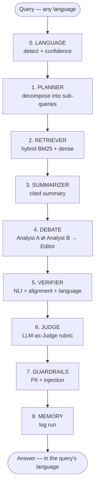

# 🤖 PolicyNeural: Multilingual Multi-Agent RAG Pipeline


-purple)

> **An intelligent, multi-agent system designed to ingest, analyze, debate, and verify complex policy documents using Hybrid RAG (Retrieval-Augmented Generation) — in English and German, with built-in LLM-as-Judge evaluation.**

---

## 📖 Table of Contents
- [Overview](#-overview)
- [Key Features](#-key-features)
- [System Architecture & Agents](#-system-architecture--agents)
- [Pipeline Flow](#-pipeline-flow)
- [Folder Structure](#-folder-structure)
- [Getting Started](#-getting-started)
- [Configuration](#-configuration)
- [Usage](#-usage)
- [Multilingual RAG](#-multilingual-rag)
- [Evaluation & LLM-as-Judge](#-evaluation--llm-as-judge)
- [Metric Reference](#-metric-reference)
- [Troubleshooting](#-troubleshooting)
- [Results & Visualization](#-results--visualization)
- [Advanced Research](#-advanced-research-task-8)

---

## 🔍 Overview

**PolicyNeural** goes beyond simple "Question & Answer" bots. It leverages a pipeline of specialized AI agents to handle the entire lifecycle of document analysis—from ingestion and topic modeling to semantic retrieval and automated debate.

The system uses a **Hybrid RAG** approach (combining sparse BM25 retrieval with dense vector search via Pinecone) to ensure high-precision answers. It goes a step further by employing debate agents that argue opposing viewpoints to reduce bias, and a verifier agent that fact-checks answers against source texts using Natural Language Inference (NLI).

Retrieval and generation are **multilingual** (English and German as first-class languages), and every run is scored by an **LLM-as-Judge** rubric plus a full **evaluation harness** that reports retrieval, generation and language metrics side by side.

**Everything except the vector store runs locally.** Generation, judging and evaluation all use [Ollama](https://ollama.com) models on your own machine; Pinecone is the only external service.

---

## 🚀 Key Features

* **🤖 Multi-Agent Orchestration:** A modular architecture where specialized agents (Ingestion, Retrieval, Debate, Verification) collaborate via a **LangGraph** state machine.
* **🔎 Hybrid Retrieval Engine:** Combines **BM25** (keyword matching) and **Pinecone** (dense semantic embeddings) with a configurable alpha threshold ($S_{final} = \alpha \cdot S_{dense} + (1-\alpha) \cdot S_{sparse}$).
* **⚖️ Automated Debate:** Two distinct agents (DebateAgent A & B) argue opposing positions on policy questions to reach a balanced consensus.
* **🛡️ Verification & Guardrails:**
    * **VerifierAgent:** Checks factuality (NLI), semantic alignment, and output language.
    * **GuardrailsAgent:** Filters PII (Personally Identifiable Information) and prevents prompt injection attacks.
* **🧠 Adaptive Memory:** A `MemoryAgent` logs parameters ($\alpha$, $k$) and auto-tunes them for improved factual precision.
* **🌍 Multilingual RAG:** Queries and documents in **English and German** share a single vector space (`paraphrase-multilingual-MiniLM-L12-v2`), so a German question retrieves relevant English sources and is answered back in German.
* **⚖️ LLM-as-Judge:** A `JudgeAgent` scores every final answer on a five-part rubric — groundedness, relevance, completeness, citation quality and language quality — using a **different model** from the generator to avoid self-preference bias.
* **📏 Evaluation Harness:** An `EvalAgent` runs a labelled query set end-to-end and reports retrieval metrics (hit@k, precision@k, recall@k, MRR, nDCG@k) alongside generation and language metrics, broken down per language.

---

## 🛠 System Architecture & Agents

The project is structured around the following specialized agents:

| Agent | Function | Techniques |
| :--- | :--- | :--- |
| **PDFIngestionAgent** | Parse PDFs, extract text/tables, chunk semantically | PyMuPDF / pdfplumber + spaCy |
| **LanguageAgent** | Language detection, output-language directives, Unicode tokenization | langdetect (seeded) |
| **PreprocessorAgent** | Detect language, tokenize, lemmatize, NER, redact PII | spaCy (en/de + `xx` fallback), regex |
| **TopicModelAgent** | Topic discovery (LDA / NMF) | scikit-learn / pyLDAvis |
| **EmbeddingAgent** | Build TF-IDF + Word2Vec + multilingual SBERT representations | sentence-transformers |
| **RetrieverAgent** | **Multilingual Hybrid RAG** (BM25 + dense Pinecone) | rank-bm25 + Pinecone + multilingual SBERT |
| **PlannerAgent** | Query decomposition in the query's language | LLM planning (JSON mode) |
| **SummarizerAgent** | Structured summary with citations, in the query's language | Mistral-7B via Ollama |
| **DebateAgents A & B** | Argue opposing positions → consensus | LangGraph loops |
| **VerifierAgent** | NLI, semantic alignment & output-language checks | Ollama + multilingual SBERT |
| **JudgeAgent** | **LLM-as-Judge** rubric scoring of the final answer | Ollama (JSON mode, temp 0) |
| **EvaluatorAgent** | LLM-as-Judge A/B comparison of retrieval strategies | Ollama (JSON mode, temp 0) |
| **EvalAgent** | **Evaluation harness**: retrieval + generation + language metrics | numpy, SBERT, JudgeAgent |
| **GuardrailsAgent** | PII redaction & prompt injection defence | regex / policy filters |
| **MemoryAgent** | Log run parameters and outcomes | JSON log |
| **VisualizerAgent** | Plot topics / confidence / agent graph | matplotlib / networkx |
| **Orchestrator** | Connect agents → pipeline | LangGraph state machine |

---

## 🔗 Pipeline Flow

The master graph, as compiled by `build_pipeline()` in `orchestrator.py`:



The **language** node runs first so every downstream agent agrees on one language
rather than each re-detecting it. A caller can pin the language explicitly — the
eval harness does this — in which case detection is skipped.

The **judge** node sits after verification and before guardrails, so it scores
the substantive brief rather than the PII-redacted output.

---

## 📂 Folder Structure

The project follows a modular structure where each agent is self-contained:

```bash
PolicyNeural/
├── data/
│   └── pdfs/                       # Place your 10+ policy PDF files here
├── results/                        # Output plots, logs, and JSON summaries
│   ├── classical_output.json       # Preprocessed chunks (Git LFS)
│   ├── multilingual_embeddings.npy # Multilingual SBERT vectors
│   ├── sbert_embeddings.npy        # Legacy English-only vectors
│   ├── memory.json                 # Per-run parameter + outcome log
│   ├── eval_report.json            # Full evaluation output
│   ├── eval_report.md              # Human-readable evaluation summary
│   └── plots/                      # Visualizations
├── queries/
│   ├── policy_queries.json
│   └── multilingual_eval_set.json  # Labelled EN/DE evaluation cases
├── src/
│   └── agents/
│       ├── config_loader.py        # Reads config.yaml, dotted-key access
│       ├── language_agent.py       # Detection, directives, tokenization
│       ├── pdf_ingestion_agent.py
│       ├── preprocessor_agent.py
│       ├── topic_model_agent.py
│       ├── embedding_agent.py
│       ├── retriever_agent.py
│       ├── planner_agent.py
│       ├── summarizer_agent.py
│       ├── debate_agent.py
│       ├── verifier_agent.py
│       ├── judge_agent.py          # LLM-as-Judge (answer rubric)
│       ├── evaluator_agent.py      # LLM-as-Judge (retrieval A/B)
│       ├── eval_agent.py           # Evaluation harness
│       ├── guardrails_agent.py
│       ├── memory_agent.py
│       ├── visualizer_agent.py
│       └── orchestrator.py         # MAIN ENTRY POINT
├── config.yaml                     # Models, languages, index, eval settings
├── requirements.txt                # Project dependencies
└── README.md
```

---

## ⚡ Getting Started

**1. Clone the repository**

```bash
git clone https://github.com/rahulrawat20022002/Data_analytics_2.git
cd Data_analytics_2
```

**2. Fetch the large data files (Git LFS)**

`results/classical_output.json` is stored via Git LFS. Without this step it is a
~130-byte pointer file and the retriever will find no documents.

```bash
git lfs install
git lfs pull
```

**3. Create a virtual environment**

```bash
python -m venv venv
source venv/bin/activate        # On Windows: venv\Scripts\activate
```

**4. Install dependencies**

```bash
pip install -r requirements.txt
python -m spacy download de_core_news_sm    # German pipeline
```

**5. Configure environment**

Create a `.env` file in the root directory. Pinecone is the only external
service — generation, judging and evaluation all run locally on Ollama:

```bash
PINECONE_API_KEY=your_key_here
PINECONE_REGION=us-east-1
```

**6. Pull the local models**

```bash
ollama pull mistral:7b              # generation (~4GB)
ollama pull qwen2.5:14b-instruct    # judge, must differ from the above (~9GB)
```

Both are Ollama models and run locally side by side — nothing is sent over the
network. The judge is deliberately a *different, stronger* model; see
[why](#why-the-judge-is-a-different-model).

**7. Build the multilingual index** — see [Re-indexing](#re-indexing-is-required).

---

## 🔧 Configuration

All models, languages, index names and evaluation thresholds live in
`config.yaml`. No agent code needs editing to change them.

| Key | Default | Purpose |
| :--- | :--- | :--- |
| `llm.model` | `mistral:7b` | Generation: planner, summarizer, debate, verifier |
| `llm.judge_model` | `qwen2.5:14b-instruct` | LLM-as-Judge and evaluation. **Must differ from `llm.model`** |
| `languages.default` | `en` | Fallback when detection is unavailable or low-confidence |
| `languages.supported` | `[en, de]` | First-class languages (tuned prompts, eval coverage) |
| `languages.names` | map | Human-readable names injected into prompts |
| `languages.spacy_models` | `en`→`en_core_web_sm`, `de`→`de_core_news_sm` | Per-language spaCy pipeline; unlisted languages fall back to blank `xx` |
| `embedding.model` | `paraphrase-multilingual-MiniLM-L12-v2` | Shared multilingual vector space |
| `embedding.dimension` | `384` | Must match the Pinecone index dimension |
| `embedding.legacy_model` | `all-MiniLM-L6-v2` | Previous English-only model, kept for A/B |
| `retrieval.index_name` | `policy-rag-index-multilingual` | New index; the English one is left untouched |
| `retrieval.alpha` | `0.5` | Hybrid weighting: `alpha * dense + (1-alpha) * sparse` |
| `retrieval.top_k` | `5` | Results returned per query |
| `evaluation.judge_scale` | `5` | Rubric scores are integers on `1..scale` |
| `evaluation.k_values` | `[1, 3, 5]` | Cutoffs for hit@k / precision@k / recall@k / nDCG@k |
| `evaluation.pass_threshold` | `4` | Judge score at or above this counts as a pass |
| `evaluation.eval_set` | `queries/multilingual_eval_set.json` | Evaluation cases |

`config_loader.py` merges `config.yaml` over built-in defaults, so a missing or
partial file degrades gracefully rather than crashing.

---

## 🏃 Usage

**Run the full pipeline** — loads queries, runs all agents, logs to memory:

```bash
python src/agents/orchestrator.py
```

**Run individual components** — each agent has a self-contained test mode:

```bash
python src/agents/pdf_ingestion_agent.py    # Ingest PDFs
python src/agents/preprocessor_agent.py     # Preprocess + detect languages
python src/agents/embedding_agent.py        # Build embeddings
python src/agents/retriever_agent.py        # Cross-lingual retrieval test
python src/agents/language_agent.py         # Language detection test
python src/agents/judge_agent.py            # Judge test (grounded vs hallucinated)
python src/agents/evaluator_agent.py        # Retrieval A/B judgement
python src/agents/eval_agent.py             # Full evaluation harness
```

**Use the pipeline from your own code:**

```python
from orchestrator import build_pipeline

pipeline = build_pipeline()
state = pipeline.invoke_query("Welche Ziele gelten für erneuerbare Energien?")

print(state["language"])        # 'de'
print(state["final_response"])  # answer, in German
print(state["judge_result"]["overall_score"])
```

`build_pipeline()` is a factory rather than module-level setup, so importing the
orchestrator does not require Pinecone credentials or a running Ollama.

---

## 🌍 Multilingual RAG

Queries in English or German are detected automatically, routed through a single
shared vector space, and answered in the language they were asked in.

| Stage | Behaviour |
| :--- | :--- |
| Detection | `LanguageAgent` (seeded `langdetect`); falls back to the default below 0.60 confidence |
| Preprocessing | `en_core_web_sm` / `de_core_news_sm`, with a blank `xx` pipeline as fallback |
| Embedding | `paraphrase-multilingual-MiniLM-L12-v2` (384-dim, ~50 languages) |
| Sparse retrieval | Unicode-aware, case-folded tokenization (replaces `text.split(" ")`) |
| Generation | Planner, summarizer and debate agents are all pinned to the query's language |
| Verification | Output language is checked independently of the LLM's own opinion |

**Cross-lingual retrieval is intentional.** Retrieval is deliberately *not*
filtered by language — the point of a shared multilingual space is that a German
query can surface a relevant English source document. Pass
`restrict_to_language=True` to `RetrieverAgent.search()` to opt out.

`langdetect` is seeded (`DetectorFactory.seed = 0`) because it is randomised by
default and otherwise returns different answers for the same short string across
runs, which would make evaluation numbers irreproducible.

**Adding a language** — add it to `languages.supported`, add a display name under
`languages.names`, and optionally map a spaCy pipeline under
`languages.spacy_models`. Anything unmapped still works via the blank `xx`
pipeline (tokenization only, no lemmas or NER).

> **Note on non-Latin scripts:** BM25 tokenization is word-boundary based, which
> suits English and German. Unspaced scripts (Chinese, Japanese) would need a
> proper segmenter before sparse retrieval is meaningful.

### Re-indexing is required

The multilingual encoder produces vectors that are **not compatible** with the
existing `all-MiniLM-L6-v2` index, even though both happen to be 384-dim. Nothing
will error — recall will just quietly be poor. Re-embed and upsert before running:

```bash
python src/agents/preprocessor_agent.py   # adds a `language` field per chunk
python src/agents/embedding_agent.py      # writes results/multilingual_embeddings.npy
python src/agents/retriever_agent.py      # creates + populates policy-rag-index-multilingual
```

The previous English index (`policy-rag-index`) and `sbert_embeddings.npy` are
left untouched, so you can A/B the two. `RetrieverAgent` guards the upsert against
vector-count and dimension mismatches and refuses to populate on a mismatch.

---

## 📏 Evaluation & LLM-as-Judge

Three distinct pieces:

* **`JudgeAgent`** — scores a *final answer* 1–5 on groundedness, relevance,
  completeness, citation quality and language quality. Runs at `temperature 0`
  in JSON mode so scores are reproducible. Its `compare()` method does pairwise
  A/B by scoring each answer **independently**, avoiding the position bias that
  affects side-by-side pairwise prompts.
* **`EvaluatorAgent`** — scores a *retrieval strategy* A/B (hybrid vs reranked).
* **`EvalAgent`** — the harness that ties it together.

### Why the judge is a different model

`config.yaml` sets `llm.model: mistral:7b` for generation and
`llm.judge_model: qwen2.5:14b-instruct` for judging. These must stay different.

An LLM scoring its own output exhibits **self-preference bias**. A same-model
judge additionally shares the generator's blind spots — a claim the generator
invented from a bad prior looks well-grounded to a judge holding that same prior,
corrupting the exact dimension the judge exists to measure. A *stronger* judge
matters as much as a *different* one: 7B models are poorly calibrated on a 1–5 scale.

Guards so this cannot regress silently:

* If the two models are set equal, `JudgeAgent` **warns at startup**, every result
  carries `self_judged: true`, and the Markdown report opens with a warning banner.
  The run still works — it is just never presented as neutral.
* A missing judge model is a **hard failure**, not a fallback to the generation
  model. A silent fallback would reintroduce self-judging without appearing
  anywhere in the report.

Two cross-checks are independent of the judge entirely: `language_check` (no LLM
involved) and `context_utilisation` (embedding-based groundedness). **A high judge
groundedness score alongside low context utilisation is your self-preference tell.**

### Running an evaluation

```bash
python src/agents/eval_agent.py                 # full run, with the LLM judge
python src/agents/eval_agent.py --no-judge      # embedding metrics only (fast)
python src/agents/eval_agent.py --limit 4       # smoke test on the first 4 cases
python src/agents/eval_agent.py --eval-set path/to/other.json
```

Output lands in `results/eval_report.json` (full detail, per case) and
`results/eval_report.md` (summary tables).

> The judge runs once per case and a 14B model is roughly 2–3× slower per call
> than the 7B generator. Use `--no-judge` when you only want retrieval metrics.

### The evaluation set

`queries/multilingual_eval_set.json` ships with 10 paired EN/DE cases, including
two deliberately **unanswerable** ones — a RAG system that confabulates an answer
about the population of Mars is failing, and a good eval set catches that.

```json
{
  "id": "carbon-pricing-de",
  "pair_id": "carbon-pricing",
  "language": "de",
  "query": "Welche Mechanismen zur CO2-Bepreisung sieht der Europäische Grüne Deal vor?",
  "relevant_doc_ids": [],
  "reference_answer": ""
}
```

`pair_id` links a question to its translation, so EN and DE performance on the
*same* question can be compared directly.

**Retrieval metrics need ground truth:** add chunk ids from
`results/classical_output.json` to `relevant_doc_ids`. Cases left unlabelled still
produce generation, language and judge metrics, so the harness is useful before
any labelling work is done.

---

## 📐 Metric Reference

All metrics are aggregated **overall and per language**, so you can see directly
whether German queries are served as well as English ones.

### Retrieval — requires `relevant_doc_ids`

| Metric | Definition |
| :--- | :--- |
| `hit@k` | 1 if at least one relevant document appears in the top *k*, else 0 |
| `precision@k` | Fraction of the top *k* that is relevant |
| `recall@k` | Fraction of all relevant documents captured in the top *k* |
| `MRR` | Reciprocal of the rank of the first relevant document (0 if none) |
| `nDCG@k` | Binary-relevance normalised discounted cumulative gain — rewards ranking relevant documents higher, not merely retrieving them |

### Generation — no ground truth needed

| Metric | Definition |
| :--- | :--- |
| `answer_relevancy` | Cosine similarity between query and answer embeddings. Cross-lingual, so a German answer to an English question is not penalised for the language gap |
| `context_utilisation` | Mean best-match similarity of each answer sentence to the context sentences. A deterministic groundedness proxy: a sentence invented from nothing has no close neighbour in the context and drags the mean down |
| `citation density` | Count of `[Source X]` tags and the ratio of sentences carrying one |
| `answer_similarity_to_reference` | Cosine similarity to `reference_answer`, when one is supplied |

### Judge

Per-dimension scores (`groundedness`, `relevance`, `completeness`,
`citation_quality`, `language_quality`), an `overall_score` (their mean), and a
`pass_rate` against `evaluation.pass_threshold`.

### Multilingual

| Metric | Definition |
| :--- | :--- |
| `language_match_rate` | Fraction of answers returned in the language that was asked. A multilingual RAG that silently answers a German question in English is failing even when the content is correct |

---

## 🩺 Troubleshooting

| Symptom | Cause & fix |
| :--- | :--- |
| `Pinecone API Key not set` | Create `.env` with `PINECONE_API_KEY`. The check also catches an unset (`None`) key, not just a placeholder |
| Retriever finds 0 documents | `results/classical_output.json` is an unpulled LFS pointer. Run `git lfs install && git lfs pull` |
| `Judge model '…' is not available in Ollama` | Run `ollama pull qwen2.5:14b-instruct`. If that tag errors, plain `qwen2.5:14b` is the same instruct-tuned build |
| `⚠️ Judge model is the SAME as the generation model` | Set a different `llm.judge_model` in `config.yaml` — scores are otherwise inflated |
| `spaCy model 'de_core_news_sm' not installed` | `python -m spacy download de_core_news_sm`. Falls back to blank `xx` (tokenization only) until then |
| `Embedding dimension mismatch` on upsert | The `.npy` file was built with a different model. Re-run `embedding_agent.py` |
| `Vector/document count mismatch` on upsert | Embeddings are stale relative to the corpus. Re-run `preprocessor_agent.py` then `embedding_agent.py` |
| German answers score badly on alignment | Confirm `VerifierAgent` is using the multilingual similarity model — the English-only model penalises correct German answers purely for the language gap |
| Ollama connection refused | The Ollama daemon isn't running. Start the Ollama app, or run `ollama serve` |

---

## 📊 Results & Visualization
The system automatically generates insights in the results/ folder:

Topic Modeling: embedding_map.png (t-SNE/PCA projections).


Retrieval Diagnostics: retrieval_ablation.json (Comparing Sparse vs. Dense performance).


Evaluation: `eval_report.md` — retrieval, generation, judge and language metrics,
broken down per language.

---

## 🔬 Advanced Research (Task 8)
This project includes a research-grade challenge module in `src/agents/retriever_experiment_agent.py`. It implements alternative architectures beyond standard RAG, such as:

- GraphRAG (Entity graphs with NetworkX)
- Cross-Encoder Reranking
- ColBERT (Late Interaction)

`EvaluatorAgent` judges these variants against the hybrid baseline.

---

👤 **Author**
Rahul Rawat

LinkedIn: [LinkedIn](https://www.linkedin.com/in/rahulrawat2r/)

GitHub: [Github](https://github.com/rahulrawat20022002)
